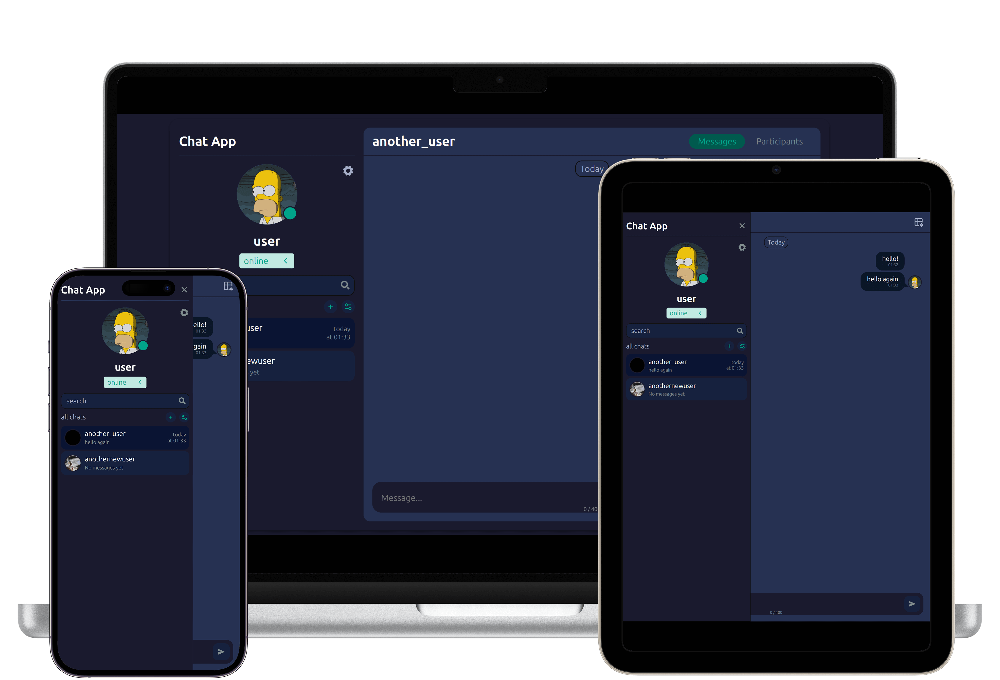

# Simple Chat Application 💬

      

A real-time chat application built with the MERN stack. Features seamless messaging, dark/light theme support, and secure authentication.

## 📸 Screenshots

| Light Theme                                    | Dark Theme                                    |
| ---------------------------------------------- | --------------------------------------------- |
|  |  |

## ✨ Features

- Real-time messaging with socket.io
- JWT authentication with automatic token refresh
- Dark/Light theme
- Responsive design optimized for all devices
- Cloudinary integration for avatar storage
- Pagination for messages, chats, and users
- React Portal modals for better UX
- Redux Toolkit for state management
- Protected routes with React Router

## 🛠 Tech Stack

### Frontend

- React - UI framework
- Redux Toolkit - State management
- React Router - Navigation and routing
- Socket.io-client - Real-time communication
- Context API - Theme and socket management
- Custom Hooks - Business logic abstraction

### Backend

- Node.js - Runtime environment
- Express - Web framework
- MongoDB with Mongoose - Database and ODM
- Socket.io - WebSocket implementation
- JWT - Authentication tokens
- Cloudinary - Media storage
- Bcrypt - Password hashing

## 🚀 Getting Started

1. Clone the repository

```bash
git clone https://github.com/e-orlovskiy/chat-app
cd chat-app
```

2. Install server dependencies

```bash
cd server
npm install
```

3. Install client dependencies

```bash
cd ../client
npm install
```

4. Environment Setup. Create a `.env` file in the server directory:

```env
# MongoDB
MONGO_URI=your_mongodb_connection_string

# JWT
JWT_ACCESS_TOKEN_SECRET=your_access_token_secret
JWT_REFRESH_TOKEN_SECRET=your_refresh_token_secret
JWT_ACCESS_TOKEN_EXPIRES_IN=15m
JWT_REFRESH_TOKEN_EXPIRES_IN=7d

# Cloudinary
CLOUDINARY_CLOUD_NAME=your_cloudinary_cloud_name
CLOUDINARY_API_KEY=your_cloudinary_api_key
CLOUDINARY_API_SECRET=your_cloudinary_api_secret

# Client URL
CLIENT_URL=http://localhost:5173

# Server Port
PORT=3000
```

5. Start the development server

```bash
# Start backend server
cd server
npm run dev

# Start frontend (in a new terminal)
cd client
npm run dev
```

## 📁 Project Structure

```text
chat-app/
├── client/                 # React frontend
│   ├── public/
│   ├── src/
│   │   ├── api/            # API calls and config
│   │   ├── app/            # Redux main store
│   │   ├── assets/         # Static assets
│   │   ├── components/     # Reusable components
│   │   ├── context/        # React contexts
│   │   ├── features/       # Redux features
│   │   ├── layouts/        # Layout components
│   │   ├── pages/          # Page components
│   │   ├── routes/         # React Router routes
│   │   ├── hooks/          # Custom React hooks
│   │   └── utils/          # Utility functions
│   ├── App.jsx
│   ├── main.jsx
│   └── package.json
├── server/                  # Express backend
│   ├── src/
│   │   ├── controllers/     # Route controllers
│   │   ├── middlewares/     # Custom middleware
│   │   ├── models/          # MongoDB models
│   │   ├── routes/          # API routes
│   │   ├── socket/          # Socket.io handlers
│   │   ├── utils/           # Utility functions
│   │   └── index.js
│   └── package.json
```
